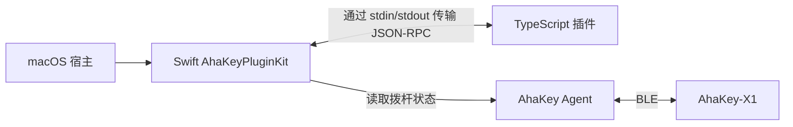

# AhaKey 插件 SDK

[English](../../sdks/README.md) · [简体中文](sdk.md)

通过 SDK 开发独立进程插件，使用 JSON-RPC 与 AhaKey 宿主通信。TypeScript SDK 负责插件端；Swift `AhaKeyPluginKit` 库负责 macOS 宿主侧的插件发现、进程管理、宿主能力和生命周期。

## 从这里开始

| 目标 | 文档或示例 |
|---|---|
| 编写 TypeScript 插件 | [TypeScript SDK 指南](typescript-sdk.md) |
| 体验宿主信息、拨杆状态和自定义 RPC | [Hello 插件](../../sdks/typescript/examples/hello-plugin/src/main.ts) |
| 学习轮询、本地持久化和退出清理 | [拨杆计数器](../../sdks/typescript/examples/lever-counter/src/main.ts) |
| 在 Swift 应用中集成插件宿主 | [Swift 宿主集成](#swift-宿主集成) |
| 为 SDK 做贡献 | [贡献指南](CONTRIBUTING.md) |

## 架构与当前支持范围



每个插件都包含 `plugin.json` 清单。宿主发现清单后启动对应命令、完成初始化握手，并提供有权限访问的 `host/*` 方法。插件也可以声明自己的方法，供宿主调用。

仓库目前提供一个插件开发 SDK：[`@ahakey/plugin-sdk`](typescript-sdk.md)。通信层使用 Node.js 流；随仓库提供的 Swift 宿主和演示程序运行于 macOS。Windows 和 Linux 客户端目前没有集成 `AhaKeyPluginKit`。当前源码中可运行的宿主入口是 `Plugin` 和 `PluginShowcase`，主桌面应用尚未通过 `PluginManager` 加载插件。

内置宿主能力为 `host/getInfo`、`host/log` 和 `host/getSwitchState`。具体行为见 [API 与权限说明](typescript-sdk.md#宿主-api)。

## 运行示例

从仓库根目录开始，需要 Node.js 18+ 和 npm。macOS 演示程序还需要 macOS 13+ 与兼容的完整 Xcode。

```bash
cd sdks/typescript
npm ci
npm run typecheck
npm test
```

构建后，打开根目录 `AhaKey Studio.xcodeproj`，选择 **PluginShowcase** Scheme 并按 `⌘R`。共享 Scheme 已配置内置示例目录；窗口每两秒读取 Hello 插件状态并支持问候调用。拨杆计数器可写入 `~/.ahakey-flow-stats.json`。

读取真实拨杆时另行运行 **AhaKeyConfigAgent** Scheme，使用完整应用前先停止该 Agent。快速验证加载、初始化和退出流程可运行 **Plugin** Scheme。路径和 Node.js 环境可在 **Edit Scheme → Run → Arguments → Environment Variables** 中调整，详见[完整示例指南](typescript-sdk.md#内置示例)。

## Swift 宿主集成

`AhaKeyPluginKit` 是当前 Xcode 工程中的原生静态库 Target。将它添加到宿主的 Target Dependencies 和 Link Binary With Libraries，再导入该模块。下面是异步宿主调用示例：

```swift
import AhaKeyPluginKit
import Foundation

func runGreeter(pluginsRoot: URL) async throws {
    let manager = PluginManager(pluginsRoot: pluginsRoot)
    await manager.loadAll()

    do {
        if let plugin = await manager.plugin(id: "com.example.greeter") {
            let reply = try await plugin.host.client.call(
                "greeter/greet",
                params: .object(["name": .string("AhaKey")])
            )
            print(reply)
        }
    } catch {
        await manager.unloadAll()
        throw error
    }

    await manager.unloadAll()
}
```

可按照 [Greeter 教程](typescript-sdk.md#创建自己的插件)创建这个示例所需的插件。加载失败时，检查 `await manager.failures`。`loadAll()` 返回成功加载的数量，单个插件发现或加载失败后会继续处理其他插件。

| 类型 | 职责 |
|---|---|
| [`PluginManifest`](../../Modules/AhaKeyPluginKit/PluginManifest.swift) | 加载 `plugin.json`，解析进程命令、参数、环境变量和工作目录 |
| [`PluginManager`](../../Modules/AhaKeyPluginKit/PluginManager.swift) | 扫描直接子目录，加载、查询和卸载插件 |
| [`PluginHost`](../../Modules/AhaKeyPluginKit/PluginHost.swift) | 注册内置宿主方法，并检查清单中的方法权限 |
| [`PluginClient`](../../Modules/AhaKeyPluginKit/PluginClient.swift) | 启动进程，支持 `call`、`notify`、请求与通知处理器，以及 stderr 转发 |
| [生命周期辅助方法](../../Modules/AhaKeyPluginKit/PluginLifecycle.swift) | 在宿主侧提供 `initialize`、`sendInitialized` 和 `shutdown` |

默认扫描目录为 `~/Library/Application Support/AhaKeyConfig/plugins/`。设置 `AHAKEY_PLUGINS_DIR` 或传入 `pluginsRoot:` 可使用开发目录。每个插件需放在一个直接子目录中，详见[清单说明](typescript-sdk.md#清单与插件发现)。

`PluginManager` 会将清单权限传给 `PluginHost`。如果直接集成 `PluginHost`，请显式传入权限集合：其默认值 `nil` 允许调用所有已注册的内置宿主方法。方法权限控制的是宿主 RPC 访问；插件进程具有启动用户正常的操作系统访问权限。

## 源码与验证

- [TypeScript SDK 实现](../../sdks/typescript/src/index.ts)
- [TypeScript SDK 测试](../../sdks/typescript/test/sdk.test.mjs)
- [Swift 命令行示例](../../Examples/PluginCLI/Plugin.swift)
- [Swift 展示窗口](../../Examples/PluginShowcase/PluginShowcaseApp.swift)
- [CI 工作流](../../.github/workflows/ci.yml)

修改 SDK 行为时，请同步更新中英文指南，并在 `sdks/typescript/` 运行 `npm run typecheck` 和 `npm test`。
