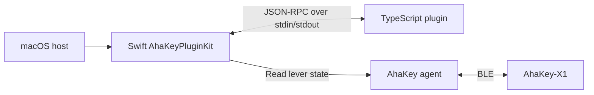

# AhaKey Plugin SDKs

[English](README.md) · [简体中文](../docs/zh/sdk.md)

Build plugins that run as separate processes and exchange JSON-RPC messages with an AhaKey host. The TypeScript SDK handles the plugin side; the Swift `AhaKeyPluginKit` library handles discovery, process management, host capabilities, and lifecycle on macOS.

## Choose your entry point

| Goal | Start here |
|---|---|
| Write a TypeScript plugin | [TypeScript SDK guide](typescript/README.md) |
| Try host metadata, lever state, and custom RPC methods | [Hello plugin](typescript/examples/hello-plugin/src/main.ts) |
| Learn polling, local persistence, and shutdown cleanup | [Lever counter](typescript/examples/lever-counter/src/main.ts) |
| Embed a plugin host in a Swift application | [Swift host integration](#swift-host-integration) |
| Contribute to the SDK | [Contributing guide](../CONTRIBUTING.md) |

## Architecture and current scope



Each plugin has a `plugin.json` manifest. The host discovers the manifest, starts its command, exchanges an initialization handshake, and exposes the permitted `host/*` methods. Plugins can also expose their own methods for the host to call.

The repository currently provides one plugin authoring SDK, [`@ahakey/plugin-sdk`](typescript/README.md). The transport uses Node.js streams; the supplied Swift host and demos run on macOS. The Windows and Linux clients do not currently integrate `AhaKeyPluginKit`. In this checkout, `Plugin` and `PluginShowcase` are the runnable host entry points; the main desktop app does not yet load plugins through `PluginManager`.

Built-in host capabilities are `host/getInfo`, `host/log`, and `host/getSwitchState`. See the [API and permissions reference](typescript/README.md#host-api) for their behavior.

## Try the examples

Run from the repository root with Node.js 18+ and npm. The macOS demos also require macOS 13+ and a compatible full Xcode installation.

```bash
cd sdks/typescript
npm ci
npm run typecheck
npm test
```

After building, open `AhaKey Studio.xcodeproj`, choose the **PluginShowcase** Scheme, and press `⌘R`. Its shared Scheme points to the bundled examples. The window refreshes Hello plugin status every two seconds and can call its greeting method; the lever counter may write `~/.ahakey-flow-stats.json`.

For real lever readings, run the **AhaKeyConfigAgent** Scheme separately and stop it before using the full app. Choose **Plugin** for a short load/initialize/shutdown check. Configure custom paths and Node.js environment under **Edit Scheme → Run → Arguments → Environment Variables**. See the [full guide](typescript/README.md#included-examples).

## Swift host integration

`AhaKeyPluginKit` is a native static-library target in the Xcode project. Add it to the host target dependencies and Link Binary With Libraries, then import the module. The example below uses an asynchronous host:

```swift
import AhaKeyPluginKit
import Foundation

func runGreeter(pluginsRoot: URL) async throws {
    let manager = PluginManager(pluginsRoot: pluginsRoot)
    await manager.loadAll()

    do {
        if let plugin = await manager.plugin(id: "com.example.greeter") {
            let reply = try await plugin.host.client.call(
                "greeter/greet",
                params: .object(["name": .string("AhaKey")])
            )
            print(reply)
        }
    } catch {
        await manager.unloadAll()
        throw error
    }

    await manager.unloadAll()
}
```

Use the [greeter tutorial](typescript/README.md#create-your-own-plugin) to create the plugin for this example. Inspect `await manager.failures` when a plugin fails to load. `loadAll()` returns the number loaded successfully and continues after individual discovery or load failures.

| Type | Role |
|---|---|
| [`PluginManifest`](../Modules/AhaKeyPluginKit/PluginManifest.swift) | Loads `plugin.json` and resolves the process command, arguments, environment, and working directory |
| [`PluginManager`](../Modules/AhaKeyPluginKit/PluginManager.swift) | Discovers immediate child directories; loads, queries, and unloads plugins |
| [`PluginHost`](../Modules/AhaKeyPluginKit/PluginHost.swift) | Registers the built-in host methods and checks the manifest's method permissions |
| [`PluginClient`](../Modules/AhaKeyPluginKit/PluginClient.swift) | Starts the process; supports `call`, `notify`, request/notification handlers, and stderr forwarding |
| [Lifecycle helpers](../Modules/AhaKeyPluginKit/PluginLifecycle.swift) | Implements `initialize`, `sendInitialized`, and `shutdown` on the host side |

The default discovery root is `~/Library/Application Support/AhaKeyConfig/plugins/`. Set `AHAKEY_PLUGINS_DIR` or pass `pluginsRoot:` to use a development directory. Place each plugin in an immediate child directory; see the [manifest reference](typescript/README.md#manifest-and-discovery).

`PluginManager` supplies the manifest permissions to `PluginHost`. If embedding `PluginHost` directly, pass an explicit permission set: its default `nil` value allows every registered built-in host method. Method permissions govern host RPC access; plugin processes run with the launching user's normal operating-system access.

## Source and validation

- [TypeScript SDK implementation](typescript/src/index.ts)
- [TypeScript SDK tests](typescript/test/sdk.test.mjs)
- [Swift CLI example](../Examples/PluginCLI/Plugin.swift)
- [Swift showcase](../Examples/PluginShowcase/PluginShowcaseApp.swift)
- [CI workflow](../.github/workflows/ci.yml)

When updating SDK behavior, update the English and Chinese guides together and run `npm run typecheck` and `npm test` from `sdks/typescript/`.
